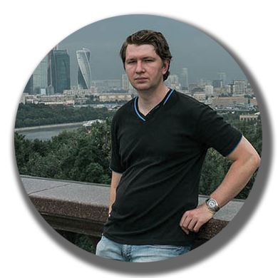
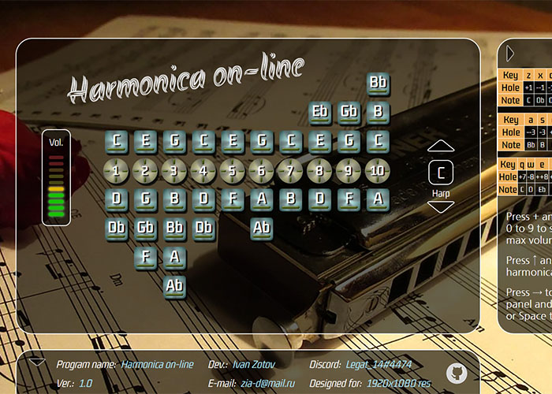
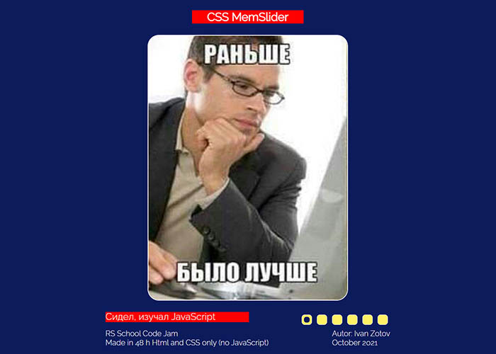
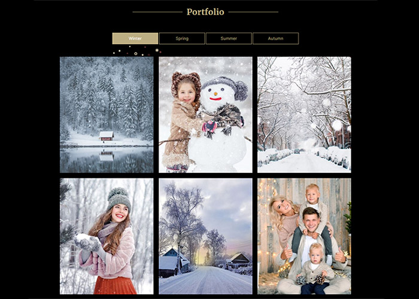
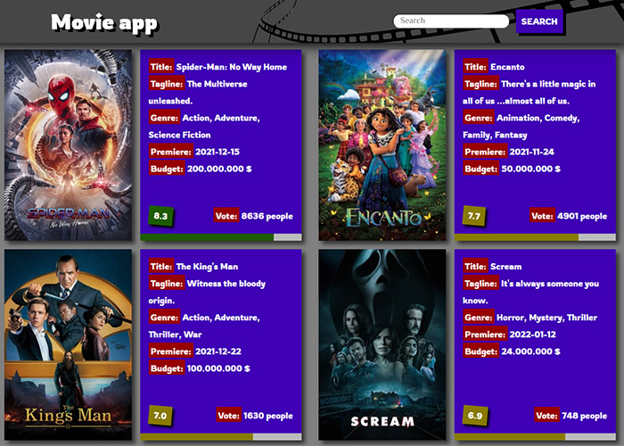
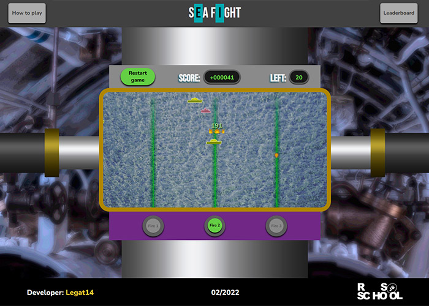

# Ivan Zotov



## About me

Hello, world!

I’m engineer from Togliatti. And I continue my way to IT. It's not easy. Espeshialy now. But I hope, I'll make it. At least I'll do my best.

This page represents the level of my skills, future plans and my apps.

So feel free to send me an email with your suggestions, or just to say “Hello and nice to meet you”.

*****

## Contacts

* **E-mail:** zia-d@mail.ru
* **Discord:** Legat_14#4474
* **GitHub:** [Legat14](https://github.com/Legat14)

*****

## Skills

### IT

Lang/Tool       | Level
-----------|-----------
 HTML | ***--
 CSS | ***--
 JavaScript | ***--
 Java | *----
 Postgre SQL | **---
 Git | **---
 Figma | ***--

### Languages

Lang       | Level
-----------|-----------
 Russian | ***** Native
 English | ***-- Intermediate
 Finnish | ***-- Basic

*****

## My apps

[On-line Harmonica](https://legat14.github.io/JS_30_Harp/)



[cssMemSlider](https://legat14.github.io/cssMemSlider/index.html)



[Portfolio site](https://legat14.github.io/portfolio/)



[Movie app](https://legat14.github.io/movie_app/)



[Sea fight](https://legat14.github.io/sea_fight/)



## IT education

**2022** - RS School - JavaScript Frontend Preschool

*****

## Code sample

```
function validParentheses(parens){
  if (parens.length == 0) { //test for 0 parentheses
    return true;
  }
  if (parens.length % 2 == 1) { //if quantity of parentheses is odd means it is invalid sequence
    return false;
  }
  let parensLeft = parens;
  let parensChange = true;
  let parensInBeginingOfCycle;
  while (parensChange) {
    parensInBeginingOfCycle = parensLeft;
    parensLeft = parensLeft.replace("()", "");
    if (parensLeft == parensInBeginingOfCycle) {
      parensChange = false; // if parensLeft didn't change means there is no more right pair of parentheses
    }
  }
  if (parensLeft == "") { // if there is no chars means all pair of parentheses was right
    return true;
  } else {
    return false;
  }
}
```

## Future plans

* RS School JavaScript Frontend course
* Improvement of SQL
* Improvement of Git
* Improvement of Java
* Employment

[Курс «JavaScript/Front-end»](https://rs.school/js/)

